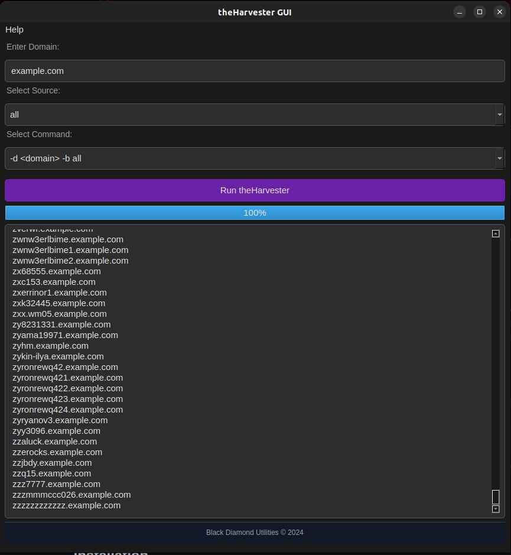

# theHarvester GUI

theHarvester GUI is a user-friendly graphical interface for theHarvester, an open-source tool used for gathering email accounts, subdomains, hosts, employee names, open ports, and banners from different public sources like search engines, PGP key servers, and the SHODAN database. This GUI is designed to make it easier for novice users to utilize the powerful features of theHarvester.

## Features

- User-friendly graphical interface
- Supports multiple data sources
- Advanced command options with a dropdown menu
- Progress bar for visual feedback during command execution
- Output and error display
- Customizable settings

## Installation

### Prerequisites

- Python 3.x
- PyQt5
- theHarvester

### Step-by-Step Guide

1. Clone the repository:

   git clone https://github.com/Mcleese902/theHarvester_GUI.git
   cd theHarvester_GUI

Install the required Python packages:

pip install pyqt5

Ensure theHarvester is installed and available in your system. Follow theHarvester's installation instructions.

Make sure theHarvester script is executable:

chmod +x /path/to/theHarvester/theHarvester.py

Run the GUI application:

python theHarvesterGUI.py

Enter the domain you want to scan in the "Enter Domain" field.

Select the data source(s) from the "Select Source" dropdown menu.

Choose the desired command from the "Select Command" dropdown menu.

Click the "Run theHarvester" button to execute the command.

View the results in the output area below.

## Screenshots

Here are some screenshots of theHarvester GUI in action:

### Main Interface

### Command Execution

